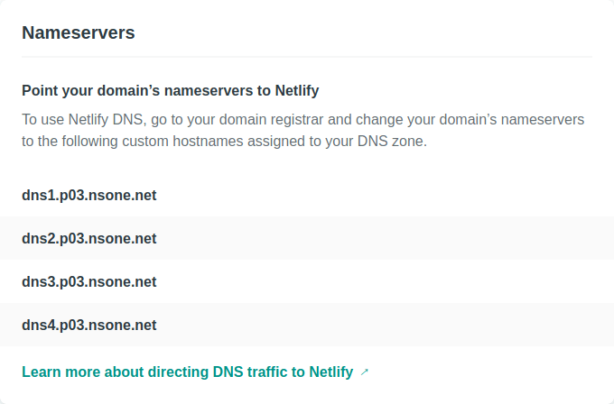

+++
title = "ブログを始めました"
date = 2020-03-28
[taxonomies]
tags = ["meta", "zola", "netlify"]
+++

この記事がブログの最初のポストです。
技術的な話題や宣伝なんかを残しておくところがなかったので、新しくブログを始めることにしました。
せっかくなので、どうやってこのブログを作ったかを簡単にまとめようと思います。

<!-- more -->

## 背景

このブログ以前にもはてなブログで[りんごがでている](http://bicycle1885.hatenablog.com/)というブログをやっていたのですが、なかなか使いづらくて頻繁に書く気にならず、年単位で放置することもしばしばでした。
はてなブログの方の最後の記事は2018年1月なので、2年以上放置していることになります。
また、Qiitaの方にもアカウントがあって少し書いていたのですが、プライバシーに関して容認できないことがあったのと、Markdownが慣れた文法と微妙に違って書きづらかったりして、結局アカウントを消してしまいました。
そこで、ふと思い立って新しくブログを始めようと思い、<https://www.bicycle1885.org>として始めました。

このブログは現在、[Zola](https://www.getzola.org/)というRust製の静的サイトジェネレータ（static site generator, SSG）を使ってHTMLなどのファイルを生成し、[Netlify](https://www.netlify.com/)上でホストしています。
ウェブサイトのレポジトリはGitHubの[bicycle1885/website](https://github.com/bicycle1885/website)に置き、`git push`をすると自動的にNetlifyへとデプロイされるようになっています。
さらに、Let's Encryptを使って通信のHTTPS化もしています。
また、ウェブサイトの作成と同時に[Google Domains](https://domains.google/)で新しくbicycle1885.orgドメインも取得しました。
以上の一番簡単なウェブページが表示されるようになるまでは、待ち時間も含めると3-4時間程度の作業量でした。


## Zolaによるサイト生成

ZolaはRustで作られたSSGです。
このようなブログはもちろん、静的なサイトならどんなものでも作れるようです。
Rust製とはいえ、Rustの知識は必要なく、Markdownを使って記事を書き、HTMLのテンプレートに埋め込み、CSS（SCSS）で修飾をするだけです。
RubyのJekyllやGoのHugoみたいなものだと言えば分かりやすいでしょうか。

Zolaを選んだ理由はいくつかありますが、個人的にRust製のソフトウェアを信用しているというのが一番大きな理由です。
今まで使ってきたRust製のプログラム（例えばripgrep）が速度も速く安定して動き、インストールも簡単だったので、Rust製のプログラムに対する信頼感がかなり高いです。
また、[ZolaのGitHubページ](https://github.com/getzola/zola)に示されている他のSSGとの比較表を見ても、機能的には遜色ないと思われます。
ただ、Hugoなどに比べるとユーザ数などでは見劣りします。

Zolaではブログ記事をMarkdownで書けます。
文法は[CommonMark](https://commonmark.org/)に準拠していますので、クセが少なく、仕様を見れば動作がわかります。
パーサの実装は[pulldown-cmark](https://github.com/raphlinus/pulldown-cmark)を使用しているようです。
ソースコードのシンタックスハイライトにも対応しています。

```julia
# Quicksort written in Julia.
quicksort(xs) = quicksort!(copy(xs))
quicksort!(xs) = quicksort!(xs, 1, length(xs))

function quicksort!(xs, lo, hi)
    if lo < hi
        p = partition(xs, lo, hi)
        quicksort!(xs, lo, p - 1)
        quicksort!(xs, p + 1, hi)
    end
    return xs
end

function partition(xs, lo, hi)
    pivot = div(lo + hi, 2)
    pvalue = xs[pivot]
    xs[pivot], xs[hi] = xs[hi], xs[pivot]
    j = lo
    @inbounds for i in lo:hi-1
        if xs[i] <= pvalue
            xs[i], xs[j] = xs[j], xs[i]
            j += 1
        end
    end
    xs[j], xs[hi] = xs[hi], xs[j]
    return j
end
```

導入や詳しい使い方について詳しくは公式マニュアルを読んでください。
もう少しZolaを理解したら、このブログでも取り上げていこうと思います。
また、実際にZolaを使ってブログを運営している<https://endler.dev/>（[レポジトリ](https://github.com/mre/mre.github.io)）が参考になりました。


## Netlifyへのデプロイ

Zolaで生成したウェブサイトは、`public`ディレクトリに吐き出されます。
ここにあるファイルをまるっとどこかにホストすれば、ウェブサイトの出来上がりです。
このウェブサイトではNetlifyをホスト先に使ってみることにしました。

Netlifyは、GitHubなどに置いたGitレポジトリが更新されると、Zolaを実行して自動的に`public`ディレクトリ内のファイルをホストする機能があります。
個人のウェブサイトであれば、無料プランで毎月100GBまでの帯域と300分までのビルド時間が使えます。
Zolaのビルドは一瞬なので、毎日何回も更新したとしても、ビルド時間の限界に達することはないのではないかと思います。

ZolaのレポジトリをGitHub上に作り、そこに次の内容のファイルを`netlify.toml`というファイル名で作成します。
Netlifyはこの設定ファイルを読み込み、Zolaを実行して静的サイトを構築するわけです。

```toml
[build]
publish = "public"
command = "zola build"

[build.environment]
ZOLA_VERSION = "0.10.1"

[context.deploy-preview]
command = "zola build --base-url $DEPLOY_PRIME_URL"
```

NetlifyにGitHubアカウントを使ってサインアップし、GitHubにあるZolaレポジトリのアドレスを登録すると、いい感じにビルドが開始されます。
ビルドがうまくいけば、始めは<https://dreamy-dijkstra-55d243.netlify.com/>のようなnetlify.comドメインに自分のサイトが作成されます。
以降は`git push`でGitHubレポジトリを更新するたびに自動でビルドとデプロイが行われます。

ウェブサイトのドメイン設定も簡単です。
Netlifyのドメイン設定のページを探すと、次のようなネームサーバのリストがあります。
これをドメインを管理しているサービス（私の場合はGoogle Domains）のネームサーバに設定するだけです。



設定がうまくいけば、次のようにNetlifyのDNSを使って自分のドメイン情報が提供されはじめます。
HTTPSはLet's Encryptを使って提供されるようで、DNSの設定が完了してしばらく待てばHTTPSも有効化されます。
ここまでくれば、<https://www.bicycle1885.org>から自分のウェブサイトにアクセスできるようになります。


という感じでブログが無事できましたので、これから丁寧に育てていきたいと思います。
